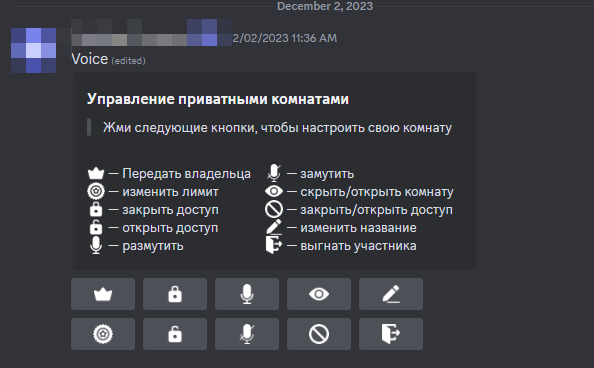

# private-rooms-bot


# Как настроить бота?
Заходим в `config.py`, и задаём значения переменных:
```python
token = 'your_token_here'
guild_id = 0

private_control_id = 0 # ID канала для создания панели управления
create_private_chan_id = 0 # ID Voice канала в дискорде
message_id = 0 # ЧИТАЙТЕ ПОДРОБНЕЕ В FAQ!

emoji1 = '<:vip:1180438222082420818>' # передать владельца
emoji2 = '<:limitededition:1180444076697452544>' # изменить лимит
emoji3 = '<:lock:1180430104334172220>' # закрыть доступ
emoji4 = '<:unlock:1180430126933082143>' # открыть доступ
emoji5 = '<:microphone:1180433814888120410>' # размутить
emoji6 = '<:microphoneoff:1180433831757627393>' # замутить
emoji7 = '<:view:1180435453699182622>' # скрыть/открыть комнату
emoji8 = '<:signal:1180438867149590578>' # закрыть/открыть доступ
emoji9 = '<:pencil:1180434371723919420>' # изменить название
emoji10 = '<:door:1180441202135408650>' # выгнать участника
```

# Подробнее про `message_id`:
`message_id` используется для изменения прошлого сообщения, дабы не спамить водном и том же канале. Возникает вопрос, как его настроить? В `config.py` мы должны задать значения всем переменным кроме `message_id` (так и оставляем `0`), запускаете бота и проверяете что всё работает, выключаете бота и копируете ID сообщения, только потом задаём значение для `message_id`.
